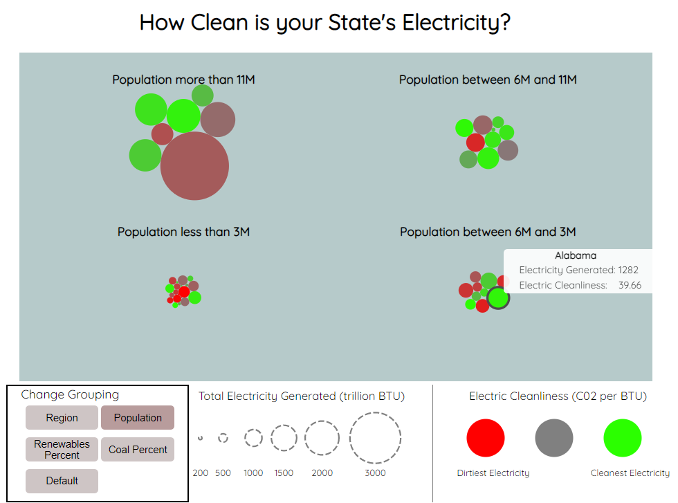
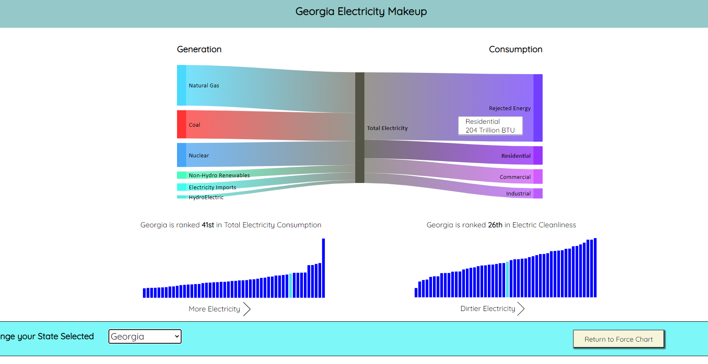

# State Electricity Force Chart

This project is an interactive visualization of every US state's electricity. It displays bubbles for each state. The size of each bubble represent's the total electricity that state consumes (measured in BTU). The color of each bubble represents the "cleanliness" of that electricity (measured in carbon dioxide per BTU). Buttons allow users to group the bubbles by geographic region, population, percentage of coal usage, and percentage of renewables. The force chart looks like this:

For a deeper dive, users can double-click any state's bubble for more visualizations on that state. Double-clicking a bubble reveals a sankey chart displaying all forms of electricity generation and consumption for that state. This page also shows how this state compares to others in terms of both total electricity consumption and the cleanliness of that electricity. The sankey chart looks like this:

